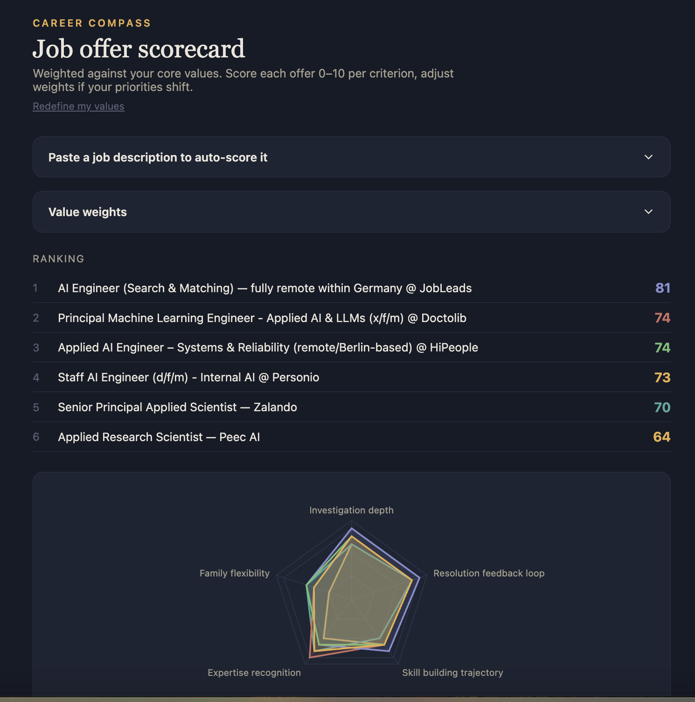

# Career Compass

A personal tool for scoring job offers against your own values — not a recruiter's checklist or a generic "culture fit" rubric, but criteria you define through a short conversation.

On first run, an AI interviewer asks you about moments at work when you felt most alive, reflects back the underlying value it heard, and builds a scoring framework from your answers. Every offer you add after that gets scored against those criteria.



## What it does

- **Values interview** — a chat-style interview that surfaces your priorities across eight dimensions (Security, Influence, Mastery, Impact, Belonging, Recognition, Stimulation, Inquiry) and synthesises them into 4–7 personalised scoring criteria
- **JD scorer** — paste a job description or a URL; the app extracts the text and scores it against your criteria with a first-pass AI read you then adjust
- **Scorecard** — radar chart + ranked list; sliders for every criterion; debounce-saved to a local JSON file between sessions
- **Job scout** (optional) — a standalone agent that searches the web for matching listings, scores them, and adds above-threshold ones to your scorecard without the app being open

## Requirements

- Node 20+
- An [Anthropic API key](https://console.anthropic.com/)

## Setup

```bash
git clone https://github.com/smoradlou/job-scorecard.git
cd job-scorecard
npm install
cp .env.example .env
```

Open `.env` and set your API key:

```
ANTHROPIC_API_KEY=sk-ant-...
```

## Running the app

```bash
npm run dev:all
```

This starts both the Vite dev server (port 5173) and the Express API proxy (port 8787). Open [http://localhost:5173](http://localhost:5173).

> `npm run dev` alone starts only the frontend — persistence and JD analysis won't work without the API server.

On first load you'll be taken through the values interview. It takes 5–10 minutes and produces your criteria set.

## Job scout (optional)

The scout is a standalone Claude agent that searches the web for job listings, scores them against your saved criteria, and saves the good ones directly to your scorecard.

**Before running:**

1. Fill in `agent/cv.md` with your profile — the more specific the "What I'm Looking For" section, the better the search targeting
2. Make sure you've completed the values interview at least once (the scout reads your criteria from `server/data/offers.json`)

```bash
npm run scout
```

The scout evaluates at least 5 new listings per run and skips any URL it's already seen (tracked in `agent/seen.json`). Saved offers appear in the scorecard on next app load.

**Options (env vars):**

| Var | Default | Description |
|---|---|---|
| `SCOUT_THRESHOLD` | `70` | Minimum weighted score (0–100) to save an offer |
| `ANTHROPIC_MODEL` | `claude-sonnet-4-6` | Model used for JD scoring inside the scout |

## Environment variables

All vars go in `server/.env` (or root `.env` — `dotenv` loads both).

| Var | Required | Description |
|---|---|---|
| `ANTHROPIC_API_KEY` | Yes | Your Anthropic API key |
| `ANTHROPIC_MODEL` | No | Model for JD analysis (default: `claude-sonnet-4-6`) |
| `PORT` | No | Express API port (default: `8787`) |
| `SCOUT_THRESHOLD` | No | Scout save threshold (default: `70`) |

## Data

Everything is stored locally — no database, no external service beyond the Anthropic API.

| Path | Description |
|---|---|
| `server/data/offers.json` | Your criteria, weights, and saved offers (gitignored) |
| `agent/cv.md` | Your profile used by the scout (gitignored) |
| `agent/seen.json` | URLs the scout has already evaluated (gitignored) |

## Stack

- **Frontend** — React 19, Recharts, Vite
- **Backend** — Express (API proxy, file persistence)
- **AI** — Anthropic API (`claude-sonnet-4-6` for scoring, `claude-opus-5` for the scout loop)
- **JD extraction** — jsdom + @mozilla/readability (same approach as Firefox Reader View)
